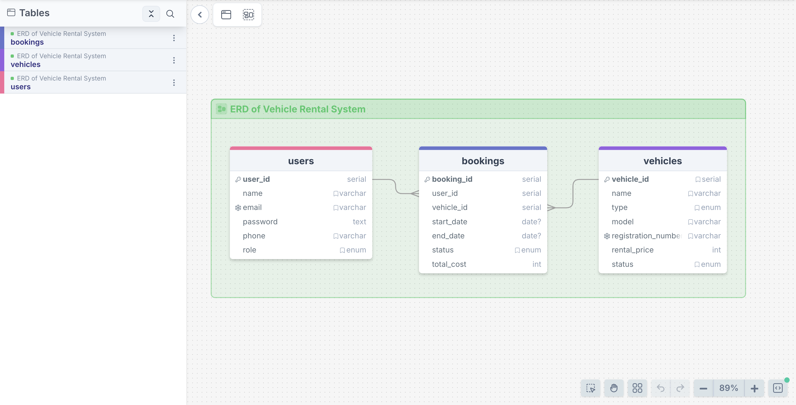

# Vehicle Rental System 

## Overview

The **Vehicle Rental System** is a database-driven application designed to manage vehicle rentals efficiently.
It allows users to browse available vehicles, make bookings, and enables administrators to manage vehicles, users, and rental operations.

## Objectives

  - Manage vehicles and their availability
  - Handle customer bookings and rental history
  - Maintain data consistency using relational database design
  - Apply business rules using SQL queries and functions

## Database Design

The system is built using **PostgreSQL** and follows a relational database model.

### Core Tables
  - **users** – stores customer and admin information
  - **vehicles** – stores vehicle details
  - **bookings** – tracks vehicle rental records

### Relationships
  - One user can make many bookings -> **One-to-many**
  - One vehicle can have many bookings -> **One-to-many**
  - Each booking belongs to one user and one vehicle -> **Many-to-one**

### ER Diagram
The ER diagram shows the relationships between users, vehicles, and bookings.

## SQL Queries

> **Check Queries & Results**: To see the results for each query, please refer to the **[Query & Results (queries_results.md)](queries_results.md)** file.

## Technologies Used

  - **Database**: PostgreSQL
  - **Query Tool**: Beekeeper Studio
  - **ERD Design**: DrawSQL App (drawsql.app)
